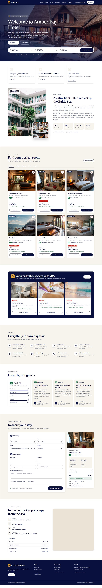
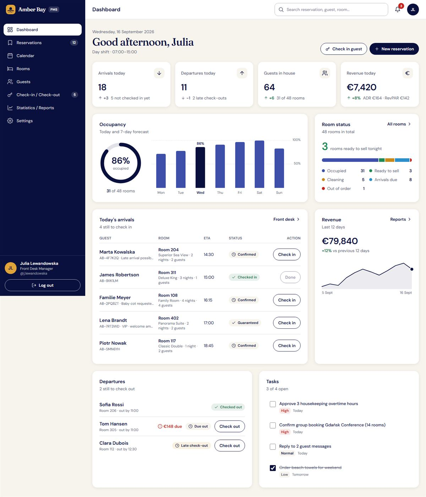
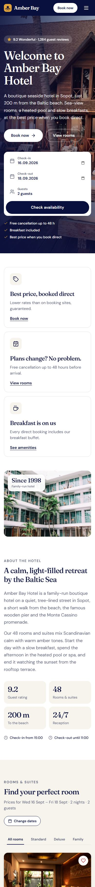
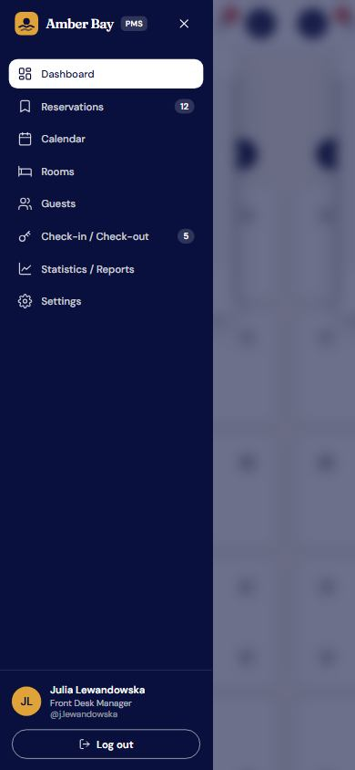

# Amber Bay Hotel: website and Employee Panel

Frontend for a boutique hotel, built with **React 19**, **Vite 7**, **Tailwind CSS 4** and **React Router**.

- **Hotel website** (`/`): hotel information, rooms, offers, reviews and an online reservation form.
- **Employee Panel** (`/panel`): a PMS-style dashboard for hotel staff.

> All content is placeholder data (a fictional hotel in Sopot, photos from Unsplash). There is no backend yet: forms and logins are demos, and nothing is sent or saved.



## Getting started

Requirements: Node.js 20.19 or newer.

```bash
npm install     # install dependencies (first time only)
npm run dev     # start the dev server at http://localhost:5173
npm run build   # create a production build in dist/
npm run preview # serve the production build locally
```

| Page | URL |
| --- | --- |
| Hotel website | http://localhost:5173/ |
| Employee Panel login | http://localhost:5173/panel/login |

**Windows tip:** if PowerShell says `running scripts is disabled on this system`, use `npm.cmd run dev`, or run `Set-ExecutionPolicy -Scope CurrentUser -ExecutionPolicy RemoteSigned` once.

## Features

### Hotel website

| Section | Features |
| --- | --- |
| Header | Sticky navigation, mobile menu, "Book now" button |
| Hero | Large photo, welcome message, date and guest search |
| About | Hotel story and key facts |
| Rooms | Category tabs, live price totals, room details dialog |
| Offers | Packages that pre-fill the reservation form |
| Amenities and reviews | Icon grid, guest ratings and quotes |
| Reservation | Validated form, live price summary, confirmation screen (demo) |
| Location | Contact details, directions, map |

### Employee Panel

| Area | Features |
| --- | --- |
| Login | Demo sign-in screen (no real authentication) |
| Sidebar | Dashboard, Reservations, Calendar, Rooms, Guests, Check-in / Check-out, Statistics / Reports, Settings; employee details and logout at the bottom; hamburger drawer on mobile |
| Header | Search for reservations, guests and rooms; notifications with unread badge; employee avatar |
| Dashboard | Today's KPIs, occupancy ring and 7-day forecast, room status, arrivals with check-in, revenue trend, departures, tasks |
| Other tabs | Placeholder pages that describe what is planned |



<p>
  
  
</p>

## Project structure

```
planing-hotel-platform/
├── index.html              HTML entry
├── package.json            scripts and dependencies
├── vite.config.js          Vite + React + Tailwind setup
├── vercel.json             Vercel deploy config (SPA routing)
├── public/                 static files (favicon)
├── docs/screenshots/       images used in this README
└── src/
    ├── main.jsx            app entry, router setup
    ├── routes.jsx          all routes: website, panel, login
    ├── index.css           design tokens and shared styles
    ├── App.jsx             hotel website page
    ├── components/         website sections
    ├── data/hotel.js       website content (rooms, prices, reviews)
    ├── lib/format.js       date and price helpers
    └── panel/
        ├── PanelLayout.jsx sidebar + header + content layout
        ├── auth.js         demo session (localStorage)
        ├── components/     sidebar, header, charts, icons
        ├── data/           sample PMS data
        └── pages/          Dashboard, Login, placeholder pages
```

## Where to edit

| What | File |
| --- | --- |
| Hotel name, rooms, prices, photos, reviews | `src/data/hotel.js` |
| Panel sample data (employee, arrivals, tasks) | `src/panel/data/panelData.js` |
| Colors, fonts, buttons, form styles | `src/index.css` |
| Routes and panel pages | `src/routes.jsx` |

## Next steps

- Backend API for reservations, rooms and guests
- Real staff authentication with roles
- Build out the placeholder panel pages
- Replace placeholder content and photos with real hotel data
